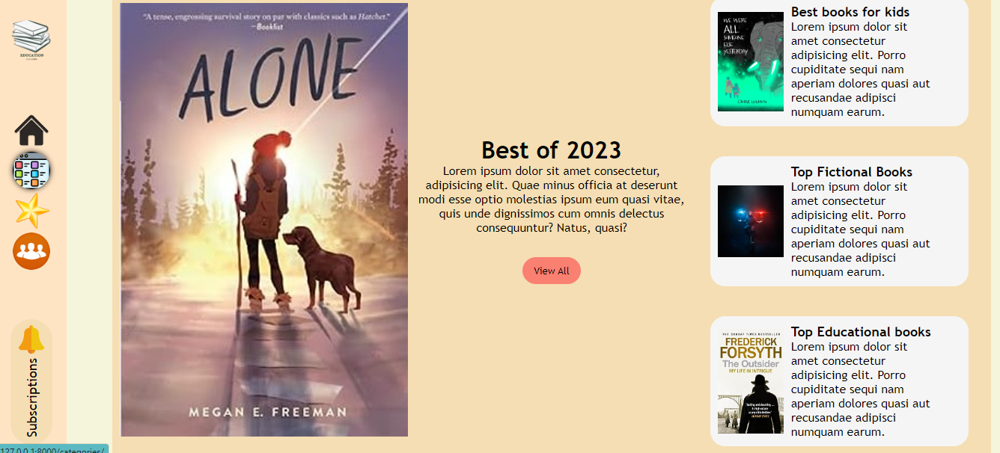

# Bookstore

An online bookstore that allows creators to publish their books, gain subscribers and donations from their fans.


## Installation
1. Clone the repository in an empty directory.
2. On Windows run ```setup\setup.bat```, on Unix ```setup/setup.sh``` in the terminal.
3. Run the server using ```python manage.py runserver```.
4. Visit http://localhost:8000/ in your browser.